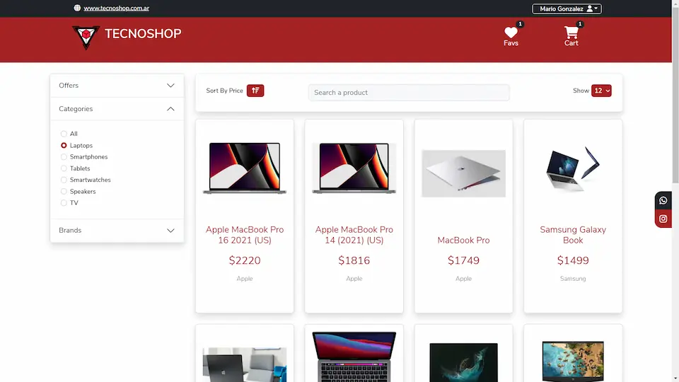
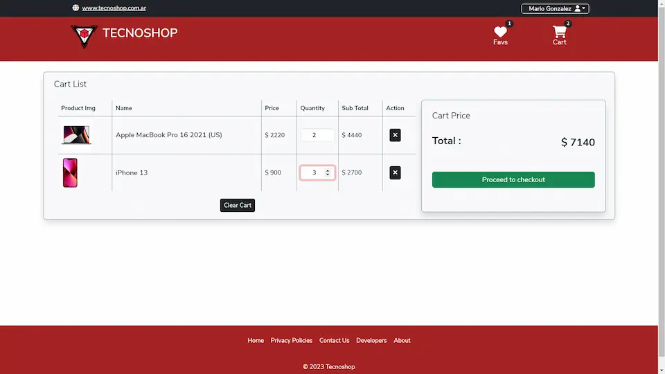
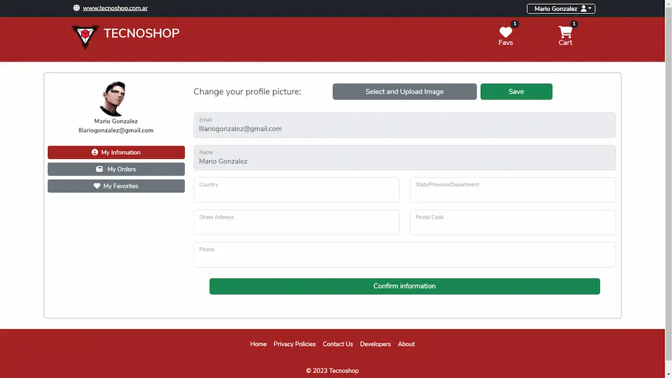
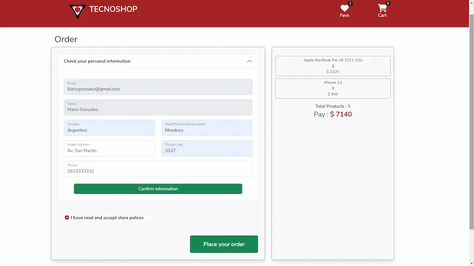
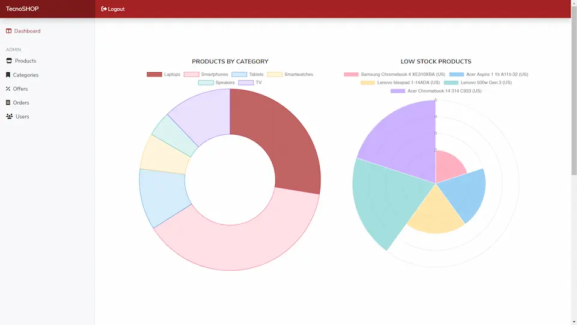

# Tecnoshop E-commerce 🔻

Desarrollo de un e-commerce para equipos tecnológicos, que permite pagos en línea a través de MercadoPago, cuenta con autenticación y autorización de usuarios, un control administrativo para el negocio tanto logistico como de marketing, cuenta también con datos estadísticos para la toma de decisiones y un completo control desde la publicación hasta la venta; integra además un bot de Whatsapp y notificaciones vía mail entre muchas otras funcionalidades ...

Puedes entrar como administrador para ver y probar mas características de la app con las siguientes credenciales:

> admin@tecnoshop.com 

> Admin001

## Imagenes y Video link🎞








[](https://youtu.be/UWWrFgAO3vo)


## Tecnologías usadas

| Seccion                          | Tecnologías                                       |
| -------------------------------- | ------------------------------------------------- |
| **Frontend**                     |  HTML, CSS, JavaScript, Bootstrapp, React y Redux |
| **Backend**                      |  Node y Express                                   |
| **Base de datos**                |  PostgreSQL y Sequelize                           |
| **Autenticación y autorización** |  Auth0, middlewares                               |
| **Pasarela de pagos**            |  Mercado Pagos                                    |
| **Almacenamiento de imágenes**   |  Cloudinary                                       |
| **Notificaciones**               |  Nodemailer, EmailJS                              |
| **Graficos**                     |  ChartJS                                          |
| **Whatsapp Bot**                 |  whatsapp-web.js                                  |
| **Animaciones**                  |  CSS y Framer-Motion                              |

## Equipo de trabajo bajo metodologías ágiles (***SCRUM***) 💻

- ***Ana Belén Gonzalvez***
- ***Juan Ignacio Grodz***
- ***Damian Gonzalez***
- ***Estefano Müller***
- ***Nahuel Puig***
- ***Enrique López***
- ***Anderson Marín***
- ***Mario Gonzalez***

## Proyecto 🚧

Código abierto, puedes clonarlo o descargarlo e instalar las depencias necesarias con npm - yarn - pnpm o el administrador de paquetes que uses, y recuerda configuar las variables de entorno necesarias .example.env

```bash
npm install
```

### Frontend React CRA ( ./client )

```bash
npm start
```

### Backend Node.js Express + PostgreSQL DB Sequelize ( ./api )

```bash
npm run dev
```
